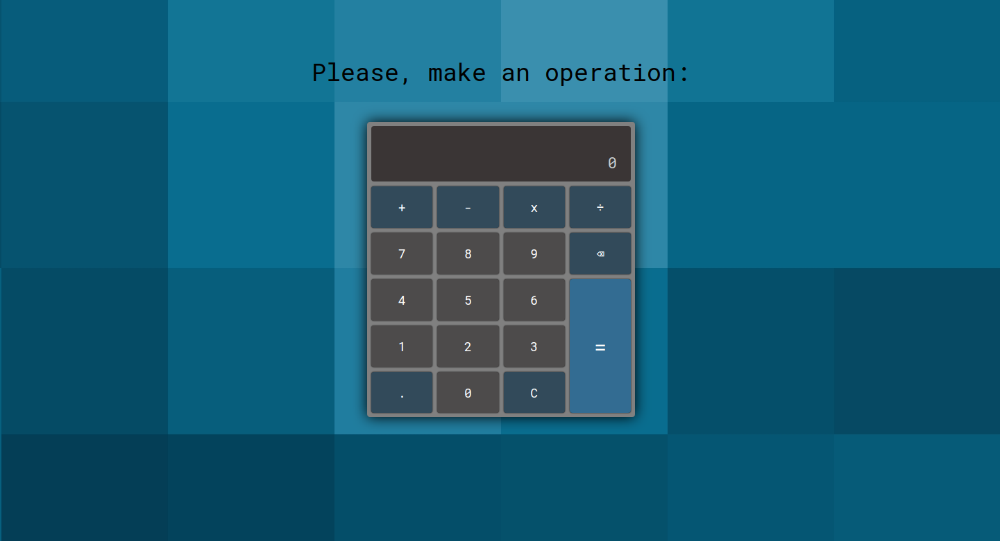

# Calculator

This project is a basic calculator. It's part of [The Odin Project](https://www.theodinproject.com/courses/web-development-101/lessons/calculator) resources. 

## Usage

Operations can be done either clicking on the calculator's buttons or using the keybord. On the keybord, enter returns the result. Multiple operattions can be done sequentially. 

## Preview

- [Live version](https://rawcdn.githack.com/bruna-genz/Calculator/78d108584d7f7f1960ab8b1a95cd2f843ae86574/calculator.html)

## Built with

- HTML 5;
- CSS 3;
- JavaScript.

## Author

:woman: **Bruna Genz**

- Github: [@bruna-genz](https://github.com/bruna-genz)
